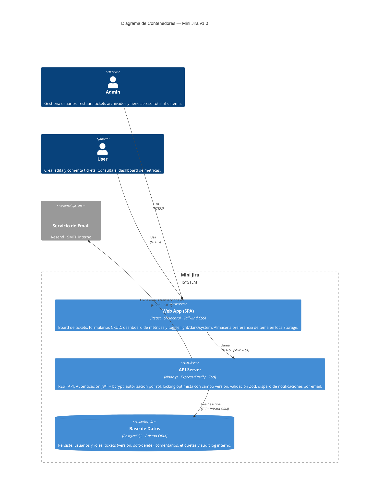

# Modelo C4 — Nivel de Contenedores · Mini Jira v1.0

> **Tipo:** C4 Container Diagram  
> **Proyecto:** Mini Jira v1.0  
> **Fuente:** PRD Mini Jira v1.0 (02 de Mayo 2026)  
> **Autor:** Arquitecto de Software

---

## Diagrama

---

## Decisiones de arquitectura

| Elemento | Justificación |
|---|---|
| **SPA separada del API** | Desacoplamiento frontend/backend; el SPA puede desplegarse en CDN |
| **API Server único** | Equipo pequeño (10 personas), v1 no requiere microservicios |
| **PostgreSQL + Prisma** | Locking optimista requiere transacciones ACID; Prisma facilita migraciones cuando los estados cambien en v2 |
| **Email como sistema externo** | Dependencia de política IT (Resend vs SMTP); el API lo abstrae con un adaptador intercambiable |
| **localStorage fuera del System_Boundary** | Es almacenamiento del navegador, no un contenedor gestionado por el equipo |
